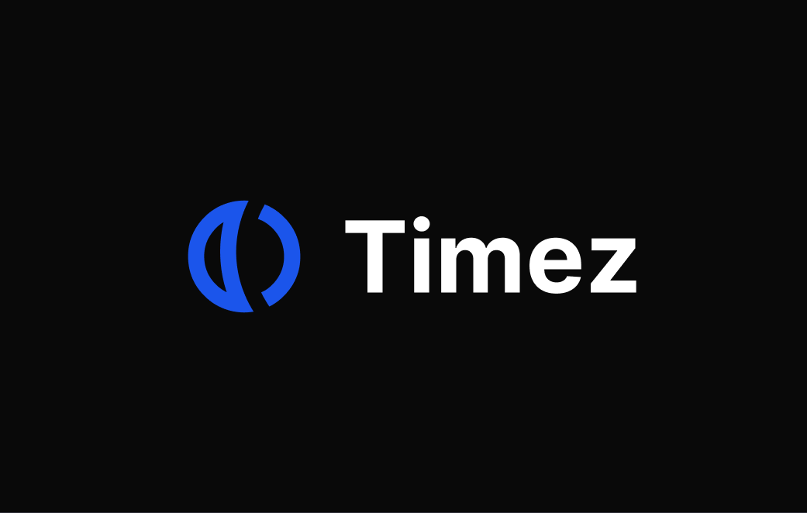

<div align="center" id="top">



&#xa0;

<a href="https://timez.eason.ch">Demo</a>

</div>

<h1 align="center">Timez - Time Zone Converter</h1>

<p align="center">
  

  

  

  

  <!--  -->

  <!--  -->

  
</p>

<hr>

<p align="center">
  <a href="#dart-about">About</a> &#xa0; | &#xa0; 
  <a href="#sparkles-features">Features</a> &#xa0; | &#xa0;
  <a href="#camera-screenshots">Screenshots</a> &#xa0; | &#xa0;
  <a href="#rocket-technologies">Technologies</a> &#xa0; | &#xa0;
  <a href="#white_check_mark-requirements">Requirements</a> &#xa0; | &#xa0;
  <a href="#checkered_flag-starting">Starting</a> &#xa0; | &#xa0;
  <a href="#memo-license">License</a> &#xa0; | &#xa0;
  <a href="#heart-author">Author</a>
</p>

<br>

## :dart: About

A timezone converter that allows users to convert time between different timezones and compare overlapping time periods.

## :sparkles: Features

:heavy_check_mark: Convert time between different timezones;\
:heavy_check_mark: Compare overlapping time periods;\
:heavy_check_mark: Dark mode support;

## :camera: Screenshots


## :rocket: Technologies

The following tools were used in this project:

- [Next.js](https://nextjs.org/): For server-side rendering and routing
- [TypeScript](https://www.typescriptlang.org/): For type safety
- [Tailwind CSS](https://tailwindcss.com/): For styling
- [shadcn/ui](https://ui.shadcn.com/): For UI components
- [luxon](https://moment.github.io/luxon/): For date and time manipulation
- [@vvo/tzdb](https://github.com/vvo/tzdb): For timezone date
- [@dnd-kit](https://dndkit.com/): For drag and drop functionality

## :white_check_mark: Requirements

Before starting :checkered_flag:, you need to have [Git](https://git-scm.com), [Node](https://nodejs.org/en/), and [pnpm](https://pnpm.io/) installed.

## :checkered_flag: Starting

```bash
# Clone this project
$ git clone https://github.com/Kamigami55/timezone-converter

# Access
$ cd timezone-converter

# Install dependencies
$ pnpm install

# Run the project
$ pnpm dev

# The server will initialize in the <http://localhost:3000>
```

## :memo: License

This project is under license from MIT. For more details, see the [LICENSE](LICENSE.md) file.

## :heart: Author

Made with :heart: by <a href="https://easonchang.com" target="_blank">Eason Chang</a> and <a href="https://carolhsiao.webflow.io" target="_blank">Carol Hsiao</a>

&#xa0;

<a href="#top">Back to top</a>
